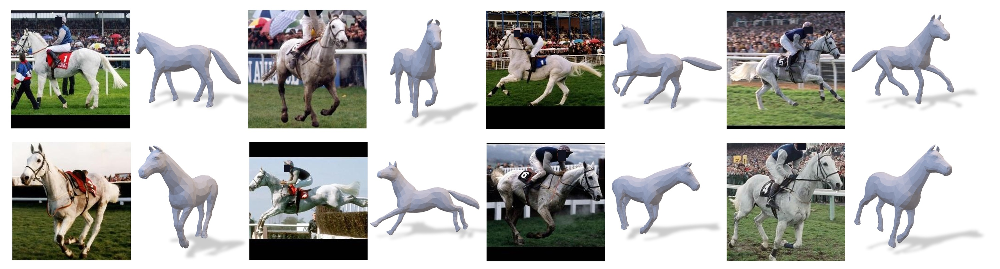

# Dessie: Disentanglement for Articulated 3D Horse Shape and Pose Estimation from Images

This repository is the official PyTorch codes of: 

Dessie: Disentanglement for Articulated 3D Horse Shape and Pose Estimation from Images \
Ci Li, Yi Yang, Zehang Weng, Elin Hernlund, Silvia Zuffi and Hedvig Kjellström

ACCV 2024




## Installation

The codes are tested in Python3.7, Pytorch 1.11.0 for Ubuntu 18.0. Below we prepare the python environment using Anaconda.

``` bash
https://github.com/Celiali/DESSIE.git

pip install torch==1.11.0+cu113 torchvision==0.12.0+cu113 --extra-index-url https://download.pytorch.org/whl/cu113

pip install -r requirements.txt
```


## Access to Data

### For the hSMAL model
The hSMAL model is available at this [link](https://sites.google.com/view/cv4horses/cv4horses).
Download the hSMAL model and place it under `./code/src/SMAL/smpl_models` folder.

For DessiePIPE or evaluation, please follow the [data preparation](data.md) instructions to prepare the data.

## Access to the pretrained weights
We provide the pretrained model available at this [link](https://drive.google.com/file/d/1mKI7HSOobdqfk65Q_9fkt9ZSVMCBm34h/view?usp=sharing).
Download and place it under `./results` folder.

```
|-- results
    |-- TOTALRANDOM (only trained on synthetic data) (trained w/o $L_gt$)
        |-- version_9:  Dessie
        |-- version_12: DinoHMR
    |-- COMBINAREAL (finetune on MagicPony dataset)
        |-- version_8: Dessie*
        |-- version_9: DinoHMR*

```  

## Run demo code

- Testing
```
python test.py
```  

- Extract Key
```
python extract_key.py
```

- Evaluation

   - Evaluation with kp transfer task  ```cd code && ./script/kptransfer.sh ```
   - PCK, IOU, AUC Evaluation on Animal Pose and Pascal dataset  ```cd code && ./script/evaluation2d_staths.sh ```
   - PCK, IOU Evaluation on MagicPony dataset ```cd code && ./script/evaluation2d_magicpony.sh ```
   - PCK, PA-MPJPE Evaluation on PFERD dataset ```cd code && ./script/evaluation_pferd.sh```
   - Chamfer distance evaluation on PFERD dataset 
```cd code && ./script/evaluation_pferd_chamfer.sh```
       - To compare with MaigcPony or 3DFauna,
            1. ```cd code/src && python evalpferd_utils/pferd.py``` to save images for MagicPony/3D Fauna as input and save all information
            2. run demo of [MagicPony](https://github.com/elliottwu/MagicPony) or [3DFauna](https://huggingface.co/spaces/Kyle-Liz/3DFauna_demo/tree/main), save ```obj, w2c, campos, posed_bones``` for all frames
            3. set ```SOTA = True, PONY (True for Magicpony, False for 3DFauna)``` in ```code/src/evaluate_chamfer_pferd.py```

- Training
```angular2html
cd code/script

# Train only with DessiePIPE
sbatch train_dessie_1.sh --> Dessie
sbatch train_dinohmr_1.sh --> DinoHMR

# Finetune with real images 
sbatch train_dessie_finetune_magicpony.sh --> Dessie finetune with Magicpony dataset
sbatch train_dessie_finetune_staths.sh --> Dessie finetune with Staths dataset
sbatch train_dinohmr_finetune_magicpony.sh --> DinoHMR finetune with Magicpony dataset
sbatch train_dinohmr_finetune_staths.sh --> DinoHMR finetune with Staths dataset
```

## Citation

If you use this code please cite
```
@inproceedings{li2024dessie,
  title={Dessie: Disentanglement for Articulated 3D Horse Shape and Pose Estimation from Images},
  author={Li, Ci and Yang, Yi and Weng, Zehang and Hernlund, Elin and Zuffi, Silvia and Kjellstr{\"o}m, Hedvig},
  booktitle={Asian Conference on Computer Vision},
  year={2024}
  }
```

If you use the PFERD dataset, please cite:
```
@article{li2024poses,
  title={The Poses for Equine Research Dataset (PFERD)},
  author={Li, Ci and Mellbin, Ylva and Krogager, Johanna and Polikovsky, Senya and Holmberg, Martin and Ghorbani, Nima and Black, Michael J and Kjellstr{\"o}m, Hedvig and Zuffi, Silvia and Hernlund, Elin},
  journal={Scientific Data},
  volume={11},
  number={1},
  pages={497},
  year={2024},
  publisher={Nature Publishing Group UK London}
}
```

## Acknowledgements

Some great resources we benefit from:
[SPIN](https://github.com/nkolot/SPIN), [avian-mesh](https://github.com/marcbadger/avian-mesh), [aves](https://github.com/yufu-wang/aves), [TEXTure](https://texturepaper.github.io/TEXTurePaper/), [Text2Tex](https://github.com/daveredrum/Text2Tex), [Staths](https://github.com/statho/animals3d), [lassie](https://github.com/google/lassie), [MagicPony](https://github.com/elliottwu/MagicPony/tree/main), [Splice](https://github.com/omerbt/Splice).